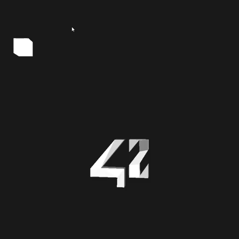
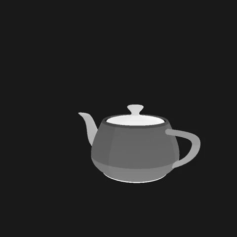
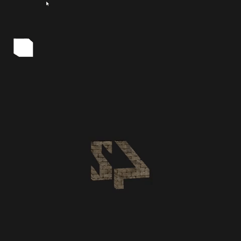
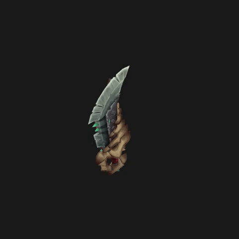
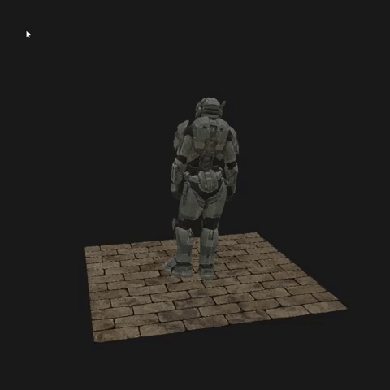
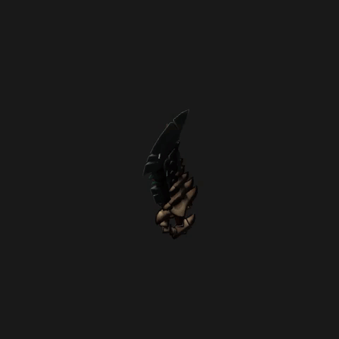
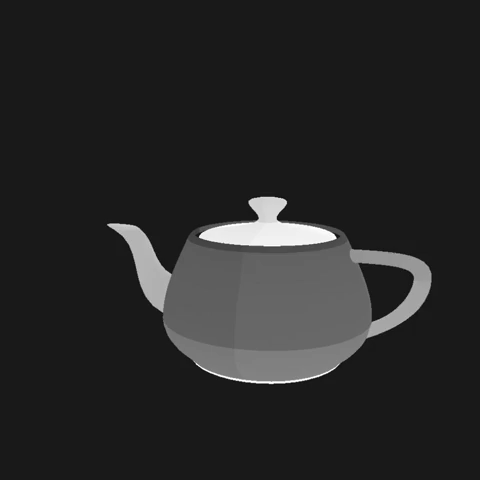
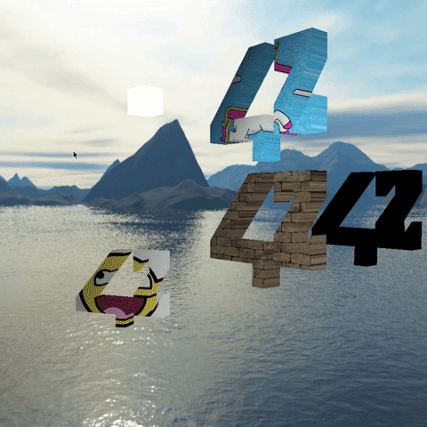

# scop [](https://github.com/JaeSeoKim/badge42)
Simple 3D engine.

Project from 42 (https://42.fr/en)

## Summary

* [Introduction](#introduction)
* [Installation](#installation)
* [How to use](#how%20to%20use)
* [Features](#features)

## Introduction

The goal of this project is to have a simple version of an OpenGL (4.0, with shaders) 3D  engine. It is written in C and uses GLFW (https://www.glfw.org/) to handle windows and events/inputs. Everything else is coded manually and I learned most of it from the amazing https://learnopengl.com.

It must be able to parse/load basic wavefronts (.obj) files, draw the object in perspective, rotating on its center and with a texture or a different color for each face. The loading of objects, images and shaders, must be done by hand (no other external library allowed).







## Installation

Working on Linux, cygwin/mingw64 and WSL (needs an X server like Xming)

```
make
```

OpenGL 4.0 is required (hence it is not going to work on Virtual Box's Linux machines, since they can handle OpenGL 3.3 at most).

GLFW is also required.

## How to use

```
scop [path to object file]
```

With no argument, a default cube object is going to open.

## Features

The program is able to load and draw any type of object (as far as I have tested), not only the basic ones. It includes objects with multiples meshes and textures. It can load the object geometry but also the texture and normal mapping, hence drawing complex and beautiful objects with their original textures:





A simple lighting system can also be used, using ambient and diffuse lights, according to objects' normal mapping:




A skybox can be drawn in the background:


Transparency is handled, allowing us to draw even more complex objects combining multiple textures, multiple shaders, lighting, and transparency:


Instead of the default GLFW events systen, a more complex input handling has been implemented in order to give the program simplicity and ergonomics:

Multi-state inputs allow us to use `on press`, `when pressed`, `on release` and `when released` events, up to 2 bindings per key. The following interactions are thus possible:

* Navigate through the scene

```
W, A, S, D, arrow or hold right click: move the camera
Hold left click: rotate the camera
```

* Change the draw mode

```
M to fill polygons, draw lines or draw points
```



* Add a new instance of the object. You can add up to 9 of them

```
Keypad '+'
```

* Move the selected object

```
1, 2, ..., 9 to select the object you want to move
Page up and down to move along the selected axis
F1: select X axis
F2: select Y axis
F3: select Z axis
```



* Change the textures of the selected object

```
N to select between one of the three modes:
-Colored
-Textured. Press T to navigate between the 5 textures
-Multiple textured: hard coded presets for complex objects (Spartan soldier, swamp and backpack)
For all of these, press shift to navigate backwards
```


* Show/Hide Skybox

```
C
```

* Light on/off

```
L
```

* Reset the camera to its original position and direction

```
R
```

## Authors

Lucas Nicosia (https://github.com/lnicosia)

